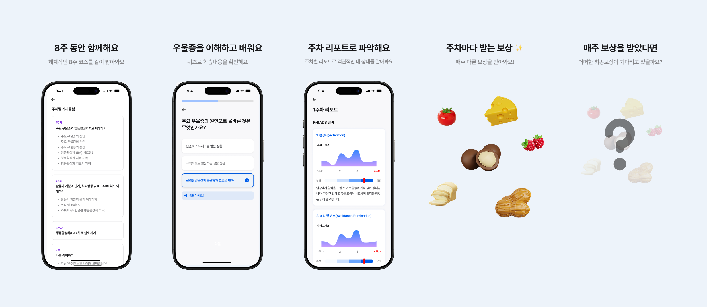

* ___비밀 유지 계약에 따라 Encryption, Resource패키지, 코드 및 일부 파일들은 비공개합니다.___  

<h1 align="center">DepRx & Sham</h1>

 <table>
    <tr>
       <td>
         
      </td>
    </tr>
    <tr>
       <td>
         
      </td>
    </tr>
 </table>

### 📌 프로젝트 개요  
DepRx는 BA 기반으로 우울증 치료한 디지털 치료제입니다. BA 추천, 선택 및 수행, K-BDS, Reward, Report등의 기능을 제공합니다.  

### 💡 프로젝트 인원 구성  
- App개발자(1명), 서버 개발(1명), 디자이너(1명) 

### ⚙️ 기술 Stack
* 기술 : Flutter, Android, iOS, Firebase
* 라이브러리 : GetX, Dio, Http등
* 상태 관리 : GetX
* Architecture : CleanArchitecture
* Package 관리 : Melos

### 🧑‍💻 프로젝트내 담당 업무  
<pre>
📱 앱 아키텍처 및 패키지 구성
- Clean Architecture 기반 설계: 유지보수성과 테스트 편의성을 고려한 계층 구조 도입
- Melos 기반 패키지 관리: 공통 모듈 분리 및 앱 멀티패키지 구조 설계
- DepRx, Sham 앱 개발: Melos 기반 구조로 병렬 앱 개발 진행

🔔 사용자 경험 및 기능 구현
- Fcm 기반 Push 알림 및 PayLoad 로직 개발
- SDUI 기반 앱 설계 및 알파데이터 수집 기능 개발: 런타임에서 UI 구성 가능하도록 설계
- 다국어 대응: 한국어/영어 언어팩 기반 다국어 기능 구현
- 소셜 로그인 통합: KakaoTalk, Google, Apple, Naver 연동 (Native 기반(kotlin, swift))
- Local DB 및 Bundle load이슈관련 Isolate, Native 활용 기능 개선
- 앱 기능 학습곡선을 줄이기 위해 단계별 튜토리얼 및 툴팁 제공

🕛 UX 편의 기능
- TF-Team Lead 및 서비스 기획
- 리프레시 타이머 기능: 매일 오전 0시 기준으로 데이터 자동 리프레시 처리
- Firebase RemoteConfig 기반 A/B 테스트 설계 및 개발
- 텍스트 대비, 크기 조정, 버튼 터치 영역 확장 등 접근성(Accessibility) 개선 요소 반영

🔒 보안 및 품질 관리
- 환경변수 및 RSA 암호화 기반 보안 기능 구현
- Sentry 기반 이슈 모니터링 및 대응 체계 구축
- GA(Google Analytics) 기반 이벤트 추적 및 사용자 행동 분석 적용
- GithubAction 활용 CI/CD 구축
</pre>

### 협업 Tool

